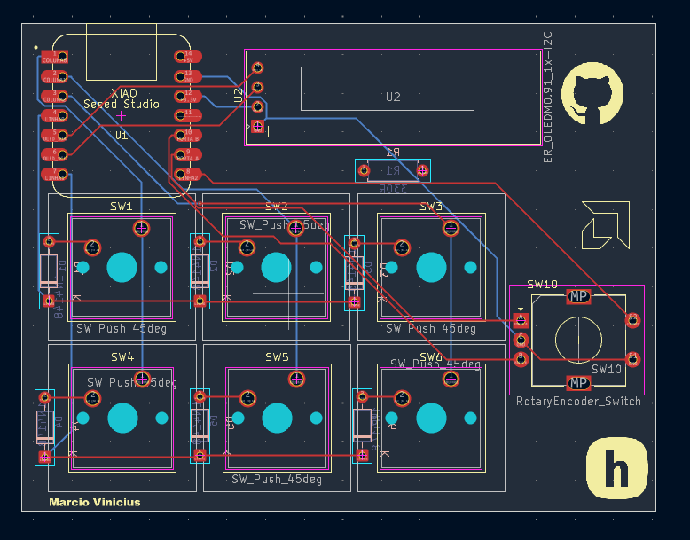
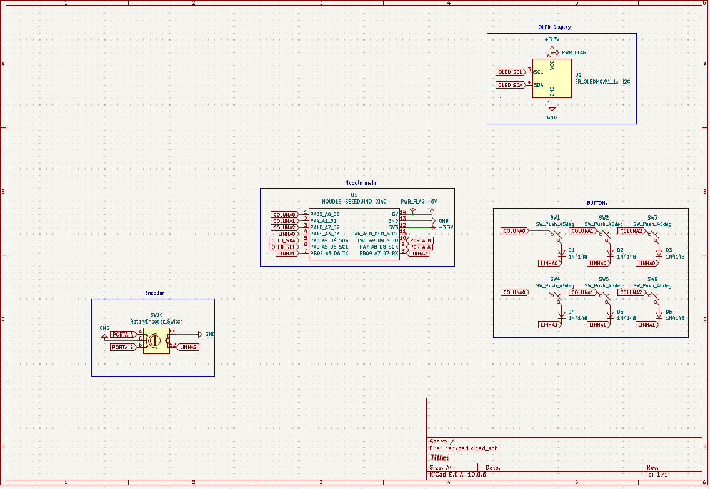
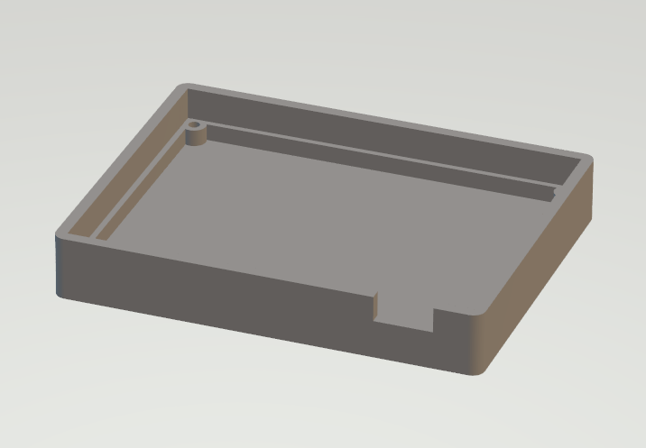
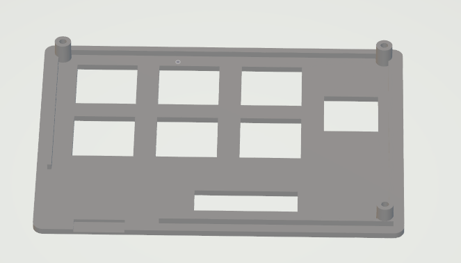
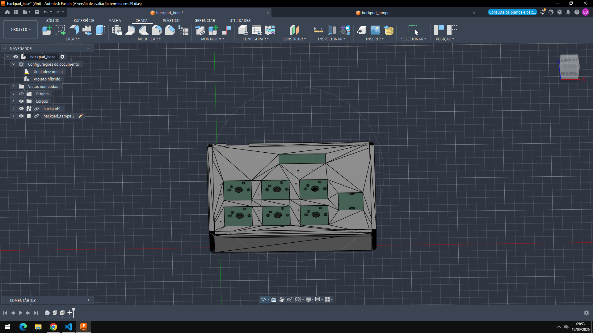

# MarcinhoPad

Custom macropad designed for the Hack Club Hackpad program.

## Overview

MarcinhoPad is a compact macro keyboard built around a Seeed XIAO RP2040. It features 6 mechanical switches, a rotary encoder for volume control, and an OLED display for visual feedback.

## Requirements Compliance

- MCU: Seeed XIAO RP2040 (through-hole)
- PCB: 2-layer, under 100mm x 100mm
- Case: 3D-printed only, fits within 200x200x100mm
- Inputs: 6 switches + 1 encoder (7 total, under 16 limit)
- Firmware: KMK (CircuitPython)

## Screenshots

### PCB

### Schematic

### Case
The case is 3D-printed in two parts (base + lid). See `production/case/` for STL files.

I couldn't place the 3D model of the PCB with the components inside the case because I wasn't able to export the 3D models in KiCad.

# Bill of Materials

| Designator | Quantity | Value | Footprint | Part Number |
|------------|----------|-------|-----------|-------------|
| U1 | 1 | Seeed XIAO RP2040 | XIAO-Generic-Hybrid-14P-2.54-21X17.8MM | Seeed XIAO RP2040 |
| U2 | 1 | 0.91" OLED SSD1306 | ER_OLEDM0.91_1x-I2C | 0.91" OLED I2C |
| SW1, SW2, SW3, SW4, SW5, SW6 | 6 | Tactile Switch 45° | SW_Cherry_MX_1.00u_PCB | Kailh Choc / compatible |
| SW10 | 1 | Rotary Encoder | RotaryEncoder_Alps_EC11E-Switch_Vertical_H20mm | Alps EC11E |
| D1, D2, D3, D4, D5, D6 | 6 | 1N4148 Diode | D_DO-35_SOD27_P7.62mm_Horizontal | 1N4148 |
| R1 | 1 | 330Ω Resistor | R_Axial_DIN0207_L6.3mm_D2.5mm_P7.62mm_Horizontal | 330Ω |

## Assembly Notes

- U1 (XIAO RP2040) is the main MCU, flashed with KMK firmware
- U2 (OLED) connects via I2C on D4 (SDA) and D5 (SCL)
- D1-D6 provide reverse polarity protection for switch matrix
- R1 is a current-limiting resistor for the OLED or indicator LED
- SW1-SW6 are the 6 key switches
- SW10 is the rotary encoder with integrated push button

## Firmware

The firmware is written in KMK for CircuitPython.

